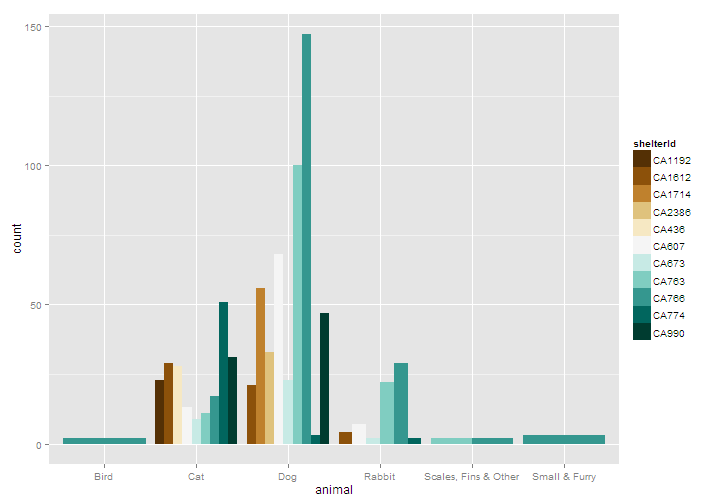
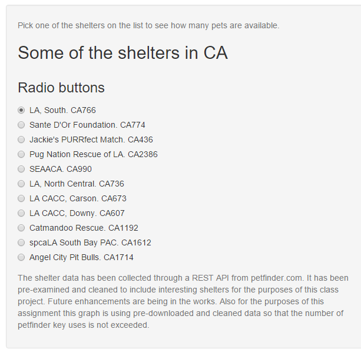
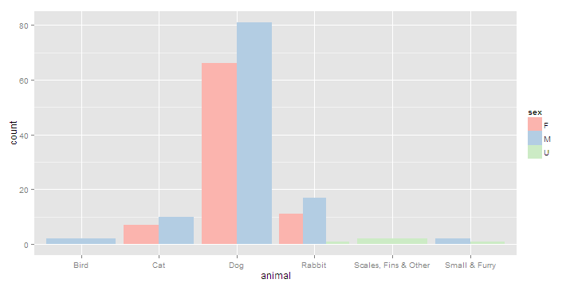

petData
========================================================
author:  Susan Lively Klug
date: Mon Dec 14 13:51:10 2015
autosize: true

What can petData tell me?
========================================================
left: 70%

petData is an interactive visual exploration of the number of
adoptable animals in shelters as supplied to [Petfinder](http://www.petfinder.com) by
the shelters and animal rescues.

- How many overall pets are available for adoption?
- What kinds of animals are available for adoption?
- At a particular shelter how many female and male pets are available?

***

Importance of viewing Shelter Data
========================================================
Adoptable animals enter the shelter life daily, sometimes in large groups.
Some will languish in the shelter for months or years, shelters make heroic
efforts to compassionately care for these pets, but a shelter will never be
as good as a home.  With the support of no-kill shelters on the rise, it is
even more important to reach adopters with information about a pet that might
be a good match.

petData is using publicly available information to show some very
basic facts about overall numbers of animals in shelters, and specific numbers
for particular chosen shelters.  More interesting questions of history and
disposition of all animals who find their way into shelters might be analyzed
if the data becomes obtainable.

Multiple Shelters
========================================================
left: 60%
 

Viewing this plot you can see the variety of animals available
in the shelters.  You can also see how many of each kind of animal
are available at each location.

***

<small>petData UI</small>
***

Shelter CA766
========================================================
Also known as Los Angeles South.  The shelter selection will
show the numbers of male, female, and in this case unknown (I guess it is
hard to tell with some fish, birds and small furry animals) that are up for
adoption at Los Angeles South Animal shelter.

 

